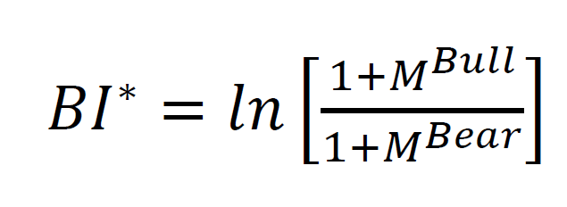
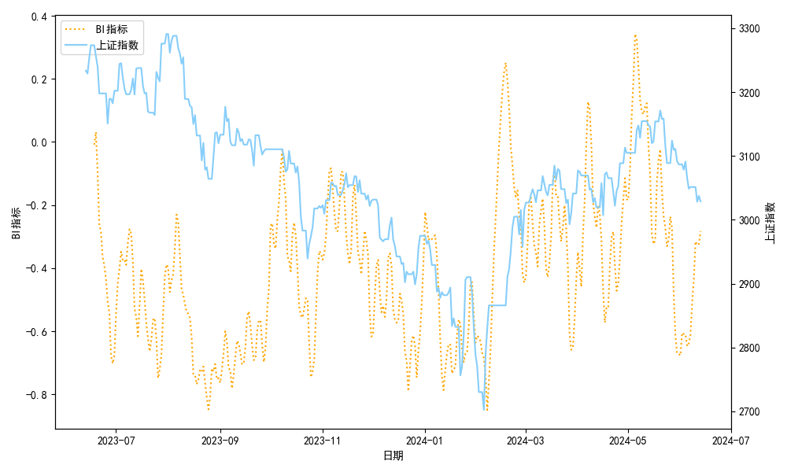

# SZ-sentiment-analysis
本项目聚合了三个部分内容：上证指数吧散户评论爬取，情感分析，并据此分析市场情绪与股价之间的关系，具体内容在对应part介绍

本项目部分实现参考了https://github.com/algosenses/Stock_Market_Sentiment_Analysis, 但数据获取及处理都是自己的工作。

作者比较喜欢该项目引言中的一句话，比较清晰地点明了情绪与股价的联系
>15年股灾时，亲历了一次交易灾难，眼见朋友的数千万在一周不到的时间内灰飞烟灭。那段时间市场的疯狂，让人深刻地明白：某些时候，股票市场这个抽象、复杂的系统，反映的不再是价值与供需，而仅仅是人的贪婪与恐惧。

作者本人虽未经历过15年的股灾，但也体验了21-24年的漫漫下跌路。尤其是24年初的千股跌停，让我感受到了那种“世界即将崩溃”的绝望。彼时所有技术指标全部失效，恐贪指标几近冰点，社交媒体上几乎看不到一点唱多的声音。然而在情绪最崩溃之时国家队和机构却疯狂买入，上证随后一个月内反弹400点。尽管外界普遍认为这不过是一次普通的护盘行动，但不禁让人思考情绪面和指数的关系。

因此本项目提供了一套从评论爬取到情感分析再到绘图的全套工具，希望对各位有所帮助。当然，限于本人能力和时间，程序做的很粗糙，各位可选择性地替换其中的功能。

由于这三个项目是做完才放到一起的，所以在路径上可能有错误之处，如果报找不到文件很可能是路径问题而已。

另外，如果你认为这个项目对你有帮助，不妨给一个star，以告诉作者这个项目还活着，会被其他人使用 qvq

## 1. SZ-spider
**请运行spider. py**

用于爬取东方财富网中，关于上证指数吧的评论(其实爬的是文章标题)。

由于上证指数吧中大多是散户评论，所以可以作为天然的情绪分析的素材。

由于没有开IP池，为了防封IP,不得已限制爬取速度，大概是80条/5s

### 注意事项
为了运行本项目，请保证你的电脑上已下载Google Chrome并安装了相应版本的驱动。为了方便，我们已将驱动放置在```${PROJECT_DIR}/chromedriver```目录下，你只需要保证浏览器版本与之适配即可（程序能正常运行不报错即为成功）

当然你也可自行选择想要的版本和驱动，对应下载链接在这里：https://googlechromelabs.github.io/chrome-for-testing/

**如果要进行情感分析操作，请把生成的comments.csv放到/data中。**

## 2. 情感分析
主要对上一阶段爬取到的新闻进行情感分析。运行sentiment_analyze.py

模型选用的huggingface上的一个比较火的bert模型，外加自己训练了一些数据。模型实际上会给出介于-1到1之间的一个值，不过为了后续处理方便，我们在分析时将其仅分为"正面"(1)和负面(0)两类。

### 关于自己训练的问题
一方面，当时疏忽导致训练数据才导入了300条，有点少。另一方面，毕竟散户评论和其他金融文本还是有点差异，所以你或许想要自己训练一个模型出来。

如果你真的想自己训练，可以参照/train文件夹的ipynb文件的方法来做。

然后训练集上，我那个参考项目中其实有4000+4000条训练数据，但我在训练前可能是忘了把他们合一起了。如果需要可以去那里找，这个合并工作应该不难。

## 3. 指数/情绪图绘制
在plt项目文件夹中，先运行compute_sent_idx,再运行polt_sent_idx,就能看到结果。

情绪指数的计算使用的是BI指数，计算公式为：


最终结果为：
